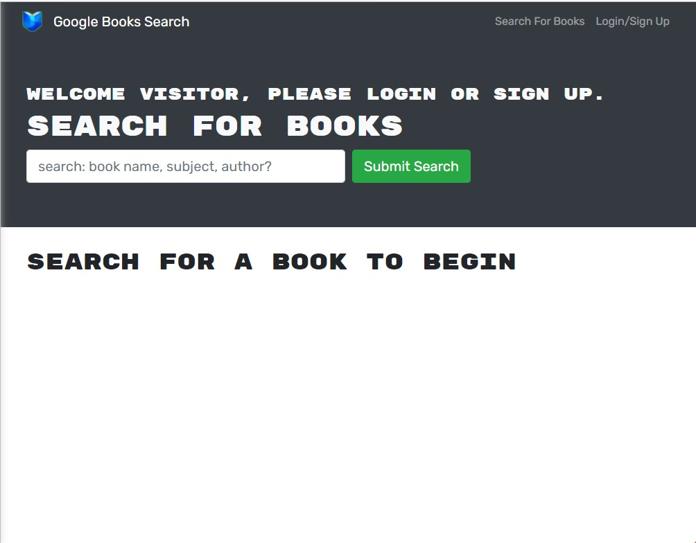

[](https://book3d.herokuapp.com)  [](https://github.com/Mark33Mark/booked) 

# USYD-FSF Week 21 Project   
 
## MERN: Book Search Engine

### Table of Contents  
  
   1. [Project Description](#1-description)
   2. [Application Features](#2-features)
   3. [Installation](#3-installation)
   4. [Usage](#4-usage)
   5. [Credits](#5-credits)
   6. [License](#6-license)
   7. [Repository Status](#7-github-repo-status)
   8. [Contribute](#8-how-to-contribute)
   9. [Tests](#9-tests)
   10. [Checklist](#10-checklist)

---

### 1. Description  

**What is this project?**  

*  Refactors a fully functioning codebase from a Google Books API search enging with RESTful API to be a GraphQL API built with Apollo Server. The app is developed using the MERN stack.
   
   [Live application:  book3d.herokuapp.com](https://book3d.herokuapp.com)  

**Why this project?**  

*  Today's successful websites are driven by data and user demands.  A cornerstone of web development is providing the ability to personalise user data.  

*  Learning GraphQL is essential to managing multiple large data API calls because it lets you call several related functions without multiple roundtrips as shown in this illustration:  
  
courtesy: https://www.apollographql.com/blog/graphql/basics/graphql-vs-rest/

*  Another great benefit of this application is that it further extends my series of apps  I've developed with the name ending '3d', specifically:  
[Not3d](https:not3d.herokuapp.com);  
[Quot3d](https:quot3d.herokuapp.com);  
[Flick3d](https:flick3d.herokuapp.com); and now  
[Book3d](https:book3d.herokuapp.com).  

**What problem does this project solve?**  

* Moves API queries and mutations to more contemporary and efficient technologies, Apollo and GraphQL.  

**Lessons learnt?**  

*  Read the User Acceptance Criteria carefully.  I thought I'd satisfied the requirements, went back and read we needed to add a link in each of the search results to the Google database for the respective book.  I went back and implemented the feature, then decided to implement a number of others, like a welcoming banner for logged in users.  In fairness, in the animation provided for the project specification, the link to Google is not there.  However, in the collection model for Book it is there so I decided we might as well use it.

*  React is awesome as it does it's best to flag issues in your code when running the code.  I discovered this can be really overwhelming when you have a large number of problems.  Best to do little steps instead of my mad approach of changing lots of areas in one pass.

*  Carefully read those error messages!  Seems I'm an expert with getting error messages and then, instead of carefully considering what the error means, I madly go off tweaking, cross checking and making changes that really have absolutely nothing to do with the error, just me in desperation trying to do something in the hope of sorting the error.  On this occassion I received an error that said 'User not logged in' when trying to save a book to the database.  But... I was logged in and receiving a server return code of 200, so all should have been good?  After hours of going over and over my code, I checked my server.js to see somehow, and I don't know when or how, I'd deleted the authority middleware including the "context: authMiddleware" from the Apollo Server instantiation:  
```const { authMiddleware } = require ('./utils/auth');```  
*  If my brain was working and I'd been looking at the problem with fresh eyes, I probably wouldn't have ended up in as deep a hole as what I ended up in.  

---

### 2. Features  

The portfolio satisfies all of the user acceptance criteria as listed in the [Checklist](#10-checklist) below.  

Additional features:  

*  Welcome banner for logged in user's, welcoming them by their username.  
*  Increased API call from default 10 records to the maximum Google API allowance of 40.  
*  Wanted to put in further pagination but decided I didn't have the time.  
*  Link provided in search results to the respective books location in the Google Books website.  *  This provides user's with a place to buy the book or see a sample they are interested in.  
*  Added some further conditional formatting, altering the colour of the buttons in search results indicating if the book has been saved already.  
*  Amended some of the 'phrasing'.  
*  The look and feel of the previous RESTful version remains in tact, my additions were mostly cosmetic.  

###Screengrabs  

  

  

  

---

### 3. Installation

You are welcome to download the source code from [my Github repository](https://github.com/Mark33Mark/booked)  

Once downloaded, you will need to install the dependencies with the following command in your terminal:  

```npm install```  

If you want to generate a deploy ready set of minimised (unreadable) code, then you will need to run the following script in the command line:  

```npm run build```  

To run the application, type in the command line:

```npm start develop```  

Enjoy.  

---

### 4. Usage  

The code can be downloaded from [my Github repository](https://github.com/Mark33Mark/booked) for all assets created for the project.  

You can modify the code as you need.

---

### 5. Credits  

*  React online documentation,
*  Stack Overflow forums.  
*  https://www.apollographql.com/blog/graphql/basics/graphql-vs-rest/
---

### 6. License  

 The works in this repository are subject to:  

[](doc/LICENSE.md)

---

### 7. Github repo status  


---

### 8. How to Contribute  

 If you would like to contribute, please comply with the Contributor Covenant Code of Conduct:  

[](doc/code_of_conduct.md)

---

### 9. Tests  

* No unit tests have been written for this application.  

---

### 10. Checklist  

 All actions not checked are still to be completed:  

[x]  This application satisfies the following acceptance criteria:  
   *   A book search engine using the Google Books API.  
   *  Loading the search engine presents you with a menu with the options to Search for Books and Login /Signup and an input field to search for books and a submit button.  
   *  Selecting the Search for Books menu option presents an input field to search for books and a submit button.  
   *  If not logged in, entering a search term in the input field and selecting the submit button
presents you with several search results; each featuring a book’s title, author, description, image, and a link to that book on the Google Books site.  
   *  Selecting Login / Signup menu option, a modal appears on the screen with a toggle to select between the option to log in or sign up.  
   *  Setting the toggle to Signup presents three inputs for a username, an email address, and a password, and a signup button.  
   *  Setting the toggle to Login, presents two inputs for an email address and a password and login button.  
   *  Entering a valid email address and creating a password and selecting the signup button,
creates a user account, and logs the user in to the site.  
   *  Entering a valid account email address and password and clicking on the login button, closes the modal and logs the user in to the site.  
   *  When logged into the site, the menu options change to: Search for Books, an option to see my saved books, and Logout.  Entering a search term in the input field, whilst still logged in, and selecting the submit button presents several search results, each featuring a book’s title, author, description, image, and a link to that book on the Google Books site and a button to save a book to my account.  
   *  Selecting the Save button on a book, saves that book’s information to the logged in account.  
   *  Selecting the menu option to see the logged in user's saved books, presents all of the books saved to the logged in account, each featuring the book’s title, author, description, image, and a link to that book on the Google Books site and a button to remove a book from my account.  
   *  Selecting the Remove button on a book, deletes the saved book from the logged in account.  
   *  Selecting the Logout button, logs out the session from the site and presents a menu with the options: Search for Books and Login / Signup and an input field to search for books and a submit button.  

[x]  Application has an Apollo Server, using GraphQL queries and mutations to fetch and modify data, replacing the existing RESTful API.  
[x]  Use an Apollo Server and apply it to the Express.js server as middleware.  
[x]  Include schema settings for resolvers and typeDefs as outlined in the homework instructions.  
[x]  Modify the existing authentication middleware to work in the context of a GraphQL API.  
[x]  Use an Apollo Provider so that the application can communicates with the Apollo Server.  
[x]  Application is deployed to Heroku [book3d.herokuapp.com](https://book3d.herokuapp.com).  
[x]  Application deployed at live URL: [book3d.herokuapp.com](https://book3d.herokuapp.com).  
[x]  Application loads with no errors.  
[x]  User experience is intuitive and easy to navigate.  
[x]  User interface style is clean and polished.  
[x]  Application resembles the mock-up functionality provided in the homework instructions.  
[x]  GitHub repository contains application code.
[x]  Application is deployed to GitHub Pages: [Github location: https://github.com/Mark33Mark/booked](https://github.com/Mark33Mark/booked)  
[x]  Application loads with no errors.  
[x]  Github repository contains application code: [Github location: https://github.com/Mark33Mark/booked](https://github.com/Mark33Mark/booked)  
[x]  Repository has a unique name.  
[x]  Repository follows best practices for file structure and naming conventions.  
[x]  Repository follows best practices for class/id naming conventions, indentation, quality comments, etc.  
[x]  Repository contains multiple descriptive commit messages.  
[x]  Repository contains quality README file with description, screenshot, and link to deployed application: [Github location: https://github.com/Mark33Mark/booked](https://github.com/Mark33Mark/booked).  

---

[Back to the top](#usyd-fsf-week-21-project)  
